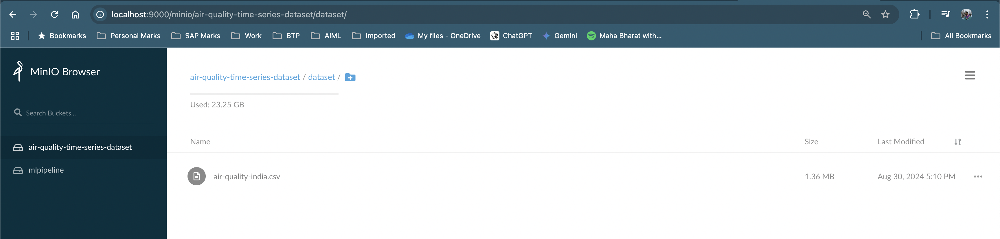
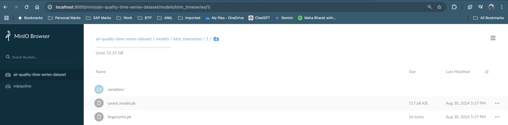
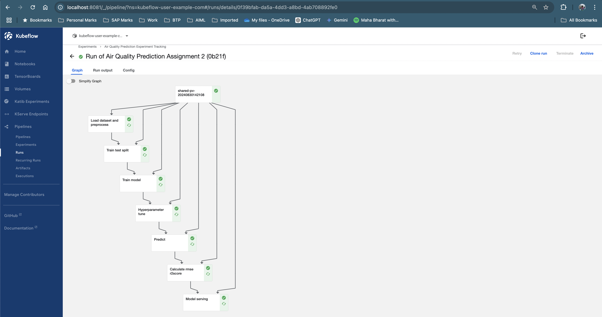
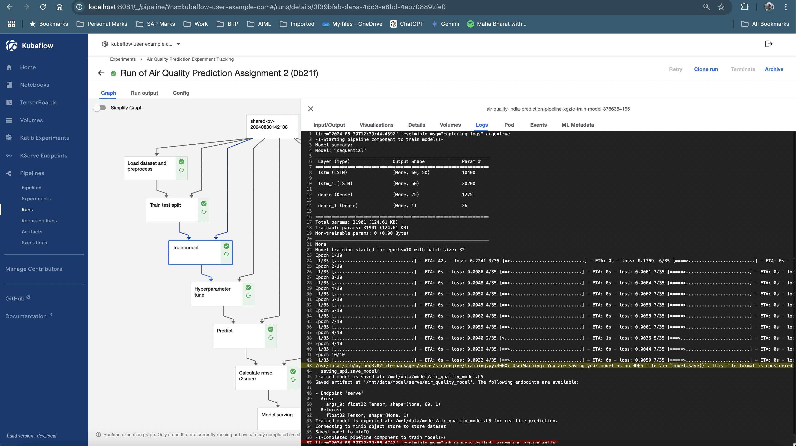
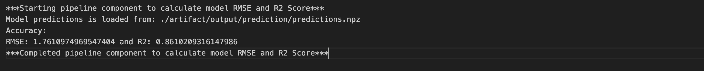
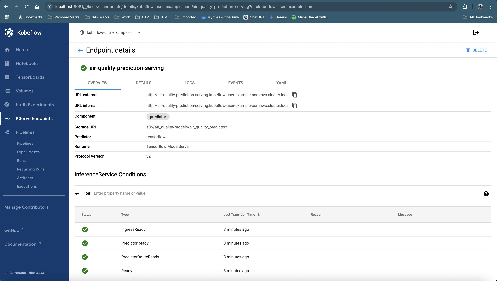
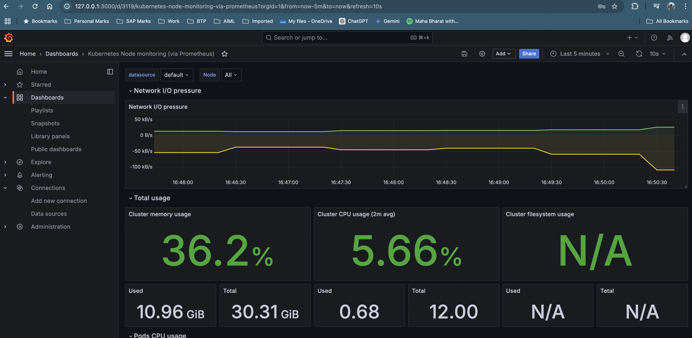

# Air Quality India Prediction Pipeline

This project implements a machine learning pipeline for predicting air quality in India using TensorFlow and Kubeflow Pipelines. The pipeline processes air quality data, trains an LSTM model, and serves the model for real-time predictions.

Screenshots:

minio used to store dataset and model (Shared across all kubeflow component container):

LSTM model store:

Kubeflow Pipeline Run:

Load Dataset container log:

Model performance logs from docker container:

Kserving Inference Service:

Grafana with Prometheus Dashboard:

## Pipeline Overview

The pipeline is defined in the `air_quality_india_prediction_pipeline.yaml` file and consists of the following components:

1. **Load Dataset and Preprocess**: Fetches the dataset from MinIO, processes it, and saves the processed data.
2. **Train-Test Split**: Splits the processed data into training, validation, and test datasets.
3. **Train Model**: Trains an LSTM model using the training and validation datasets.
4. **Hyperparameter Tuning**: Tunes the model's hyperparameters using Katib.
5. **Predict**: Uses the trained model to make predictions on the test dataset.
6. **Calculate RMSE and R2 Score**: Evaluates the model's performance using RMSE and R2 score.
7. **Model Serving**: Deploys the trained model using KServe for real-time predictions.

## Prerequisites

- **Kubeflow Pipelines**: Ensure Kubeflow is installed and configured in your environment.
- **MinIO**: Used for storing datasets and models.
- **Python**: Required for running the pipeline components.

## How to Run the Pipeline

1. **Upload the Pipeline**:
   - Use the Kubeflow Pipelines UI or CLI to upload the `air_quality_india_prediction_pipeline.yaml` file.

2. **Run the Pipeline**:
   - Specify the required parameters (e.g., `epochs`) and start the pipeline.

3. **Monitor the Pipeline**:
   - Track the progress of each component in the Kubeflow Pipelines UI.

4. **Access the Model**:
   - Once the pipeline completes, the trained model will be deployed and accessible via KServe.

## Key Components

### Load Dataset and Preprocess
- Fetches the dataset from MinIO.
- Processes the data by converting timestamps and calculating daily averages.

### Train-Test Split
- Splits the processed data into training, validation, and test datasets.
- Scales the data using Min-Max scaling.

### Train Model
- Trains an LSTM model on the training dataset.
- Saves the trained model and exports it for real-time predictions.

### Hyperparameter Tuning
- Uses Katib to optimize hyperparameters like learning rate and batch size.

### Predict
- Uses the trained model to make predictions on the test dataset.
- Saves the predictions and true values for evaluation.

### Calculate RMSE and R2 Score
- Evaluates the model's performance using RMSE and R2 score metrics.

### Model Serving
- Deploys the trained model using KServe for real-time predictions.

## Pipeline Parameters

- `epochs`: Number of epochs for training the model (default: 1).

## Tools and Technologies

- **TensorFlow**: For building and training the LSTM model.
- **Kubeflow Pipelines**: For orchestrating the pipeline.
- **MinIO**: For object storage.
- **KServe**: For serving the trained model.

## Authors

- Manglam Kumar (manglamsingh10@gmail.com)